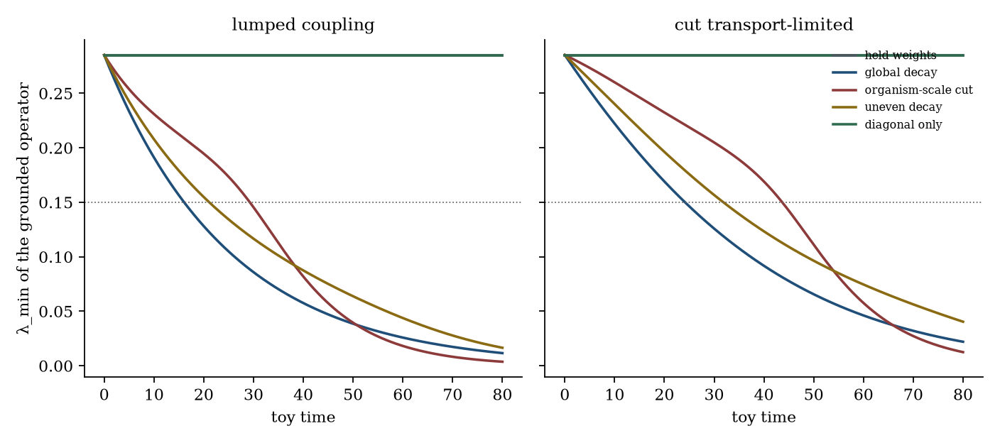
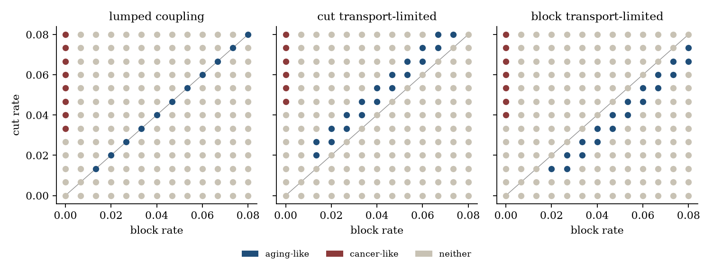
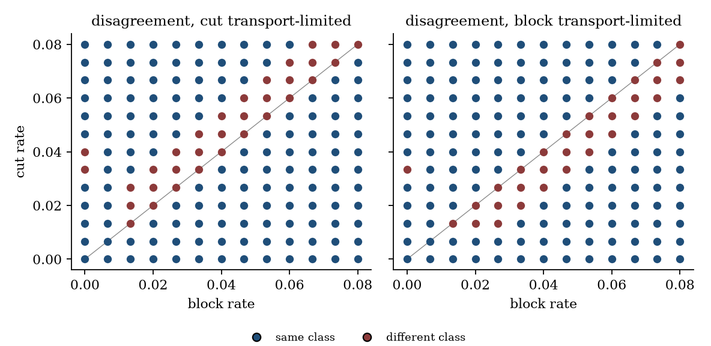
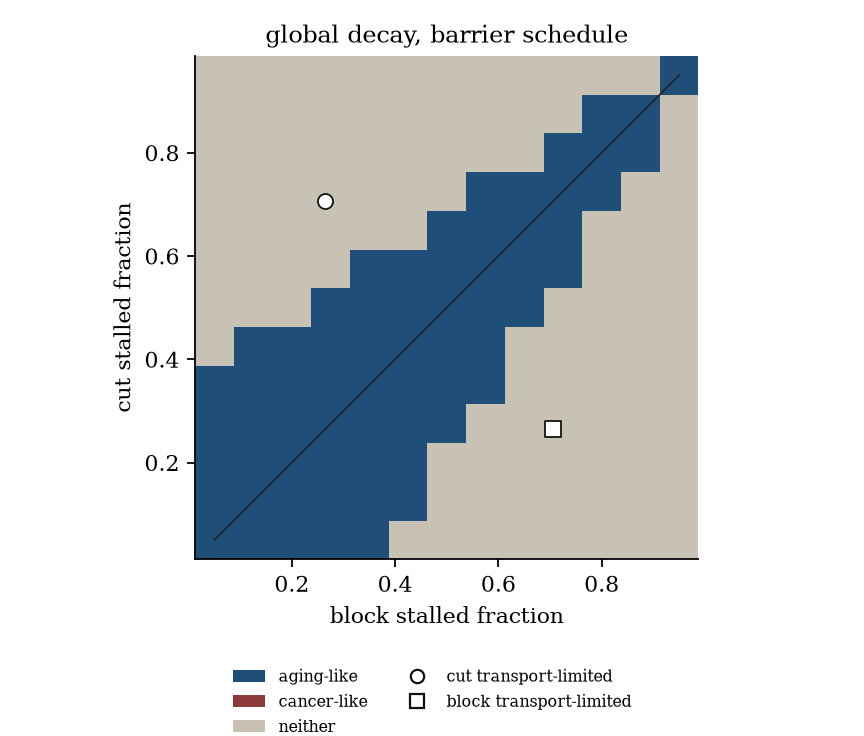

# Aging-like BAC sectors when coupling travels through barrier-limited desmoplastic edges

**Thesis #32. Computational research thesis**  
**Depends on:** Thesis #25 and Thesis #21  
**Author:** Kelechi Emeka Ogbonna  
**Correspondence:** kelechiogbonna300@gmail.com · https://github.com/cloudynirvana/thesis-32-bac-sectors-under-barrier-transport  
**Date:** 21 September 2026  
**Format:** B.Sc. project chapters (Nile University style), written as a computational methods manuscript  
**Status:** A joint reading of a sector classifier and a barrier-limited edge on one five-index toy, plus a seeded numerical check. Not a measurement of aging or of stroma.  
**Citation style:** numbered Vancouver. A `doi:` field appears only where Crossref returned the record.  
**DOI:** none for this document. Do not invent one.

---

## Title page

**AGING-LIKE BAC SECTORS WHEN COUPLING TRAVELS THROUGH BARRIER-LIMITED DESMOPLASTIC EDGES**

BY

**KELECHI EMEKA OGBONNA**

A COMPUTATIONAL RESEARCH THESIS  
(IN-SILICO COMPARISON OF LUMPED AND BARRIER-COUPLED SECTOR MAPS)

SUBMITTED AS A CITEABLE MANUSCRIPT FOR JOURNAL / THESIS HANDOFF

PROJECT CONFLUENCE  
INDEPENDENT COMPUTATIONAL RESEARCH

SUPERVISOR: not appointed for this deposit

SEPTEMBER 2026

---

## Declaration

I, Kelechi Emeka Ogbonna, declare that this computational research thesis was carried out by me. The sector labels, eigenvalue ratios, and coincidence counts reported here were produced by `sim/barrier_sectors.py` at seed 20260921. The seed governs two hundred monotonicity draws and fifty quadratic-form checks. The sector grids are deterministic. The numbers are not wet-lab measurements and not patient outcomes. No DOI, ORCID, or journal acceptance was invented for this document. No eigenvalue was copied from Thesis #25, and no rank or profile was copied from Thesis #21. The stalled fractions were recomputed from the generating pairs stated in Thesis #21.

_________________________     _______________________  
Kelechi Emeka Ogbonna         Date

---

## Abstract

Do aging-like Bounded Adaptive Coherence sectors that appear under lumped coupling still appear when the same subsystem couples only through barrier-limited desmoplastic edges, or does the barrier schedule carve a different sector map?

The barrier schedule carves a different map when the stalled fractions differ by sector. The shared object is a five-index weight matrix. Thesis #25 classes a path of that matrix by the terminal ratios of a grounded Laplacian eigenvalue and of two edge means. Thesis #21 writes each transported edge as a shedding rate and a desmoplastic conductance, and shows that a node field sees only their series flux. This deposit keeps the classifier and replaces the lumped weight, along each edge, by that flux. Shedding decays with the rate schedule of Thesis #25. The conductance is held by a schedule declared before the labels are read.

Under lumped coupling, global decay is aging-like. The grounded-eigenvalue ratio on toy time 0 to 80 is 0.040762, the sector ratio is 1, and the constant-proxy crossing is at toy time 16.055. A uniform stalled fraction keeps the same class. The series flux is then a common factor of the initial matrix, the sector ratio remains 1, and the eigenvalue ratio rises from 0.040762 at a vanishing stalled fraction to 0.054635, 0.078331, and 0.126241 at the three fractions taken from Thesis #21. All three remain below one half, so the aging column still holds. The closed form says a uniform schedule on this path leaves the column only if the stalled fraction exceeds 0.957506.

The two schedules that assign different fractions to the cut and to the block do not keep the class. With the transport-limited fraction 0.705882 on the cut and the shedding-limited fraction 0.264706 on the block, global decay has sector ratio 0.432781. With the fractions swapped, the sector ratio is 2.310638. The aging band is the open interval (2/3, 3/2). Both ratios lie outside it. Both paths are classed neither. On both, the eigenvalue ratio is still below one half (0.077337 and 0.101437), and the cut-transport reading still crosses the proxy 0.15, at toy time 24.147. The class moves because the two edge means no longer fall together. It does not move because the eigenvalue has been rescued.

On a 13×13 rate plane, 169 nodes, the lumped map has 11 aging-like nodes and 8 cancer-like nodes. Under either sector-split schedule the aging-like intersection with that lumped set is empty. Each split writes 19 aging-like nodes of its own. The Jaccard index of the two aging-like sets is 0. The same splits move 32 and 31 labels in all. A uniform transport-limited fraction moves only 5 labels, and 10 of the 11 lumped aging-like nodes remain. Co-decay, in which the conductance carries the same exponential as the shedding, restores the lumped matrix. All 169 labels agree, and the named-path ratio gap is a round-off.

The organism-scale cut stays cancer-like on the named path under every schedule in the script, and under all 169 stalled-fraction pairs on that path. Aging-like labels still exist after the barrier is introduced. They do not occupy the lumped set once the barrier schedule distinguishes the cut from the block.

The initial grounded eigenvalue 0.285102 agrees with the value printed in Thesis #25 because the weight matrix was rebuilt. The sector ratios 0.432781 and 2.310638 are not in that deposit. No Gompertz residual was recomputed. No entropy production was computed. The names "aging-like" and "transport-limited" are labels on this toy.

Research only. Not a medical device, not a rejuvenation method, and not a cure.

---

## Keywords

bounded adaptive coherence; sector classifier; grounded Laplacian; desmoplastic conductance; series flux; stalled fraction; barrier schedule; research only

---

## Table of Contents

DECLARATION  
ABSTRACT  
Table of Contents  
List of tables and figures  

CHAPTER ONE. INTRODUCTION  
1.1 Background to the study  
1.2 STATEMENT OF RESEARCH PROBLEM  
1.3 JUSTIFICATION OF STUDY  
1.4 AIM AND OBJECTIVES OF THE STUDY  
1.5 SIGNIFICANCE OF THE STUDY  
1.6 SCOPE OF THE STUDY  

CHAPTER TWO. LITERATURE REVIEW  
2.1 A sector label is a property of a weight matrix  
2.2 A desmoplastic edge is a pair of rates  
2.3 The series flux is a Schur complement  
2.4 A schedule can move a ratio that a common factor cannot  
2.5 What this deposit does not reopen  

CHAPTER THREE. MATERIALS AND METHODS  
3.1 Design, and a rule against repairing either object  
3.2 Weights, Laplacian, and the sector classifier  
3.3 Lumped decay, and the series flux on the same edges  
3.4 Schedules fixed before the labels were read  
3.5 Propositions  
3.6 The rate plane and the stalled-fraction plane  
3.7 What was not done  

CHAPTER FOUR. RESULTS  
4.1 The lumped map returns the five predeclared classes  
4.2 A uniform stalled fraction keeps global decay aging-like  
4.3 A split stalled fraction moves that path to neither  
4.4 On the rate plane the aging-like sets come apart  
4.5 The stalled-fraction plane at fixed rates  
4.6 Co-decay and a transparent conductance restore the lumped map  
4.7 Checks  

CHAPTER FIVE. DISCUSSION, CONCLUSION AND RECOMMENDATION  
5.1 Discussion  
5.2 Conclusion  
5.3 Recommendation  

REFERENCES  
DISCLAIMER  

---

## List of tables and figures

**Table 3-1.** Initial symmetric weights.  
**Table 3-2.** Edge rates on the five named paths.  
**Table 3-3.** Classifier thresholds.  
**Table 3-4.** Stalled fractions taken from the generating pairs of Thesis #21.  
**Table 3-5.** Coupling schedules.  
**Table 4-1.** Class of each named path under each schedule.  
**Table 4-2.** Terminal ratios of global decay.  
**Table 4-3.** Terminal ratios of the organism-scale cut.  
**Table 4-4.** Coincidence of lumped and barrier labels on the rate plane.  
**Table 4-5.** Classes on the equal-rate diagonal.  
**Table 4-6.** Class counts on the stalled-fraction plane.

**Figure 4-1.** Grounded λ_min under lumped coupling and under the cut-transport schedule.  
**Figure 4-2.** Sector class on the rate plane.  
**Figure 4-3.** Where the rate-plane class differs from the lumped class.  
**Figure 4-4.** Sector class of global decay across the stalled-fraction plane.

Figures are diagnostics from `sim/barrier_sectors.py`. They are not measured networks and not stromal images.

---

# CHAPTER ONE

## 1.0 INTRODUCTION

### 1.1 Background to the study

Aging and cancer are often placed in one review because both are failures of maintenance, and because two hallmark lists can be printed side by side [1–3]. A label that contains one of those words is a different object from either list. Kirkwood's account of aging refuses a single programme that one would switch off [4]. That refusal matters here because it blocks a shortcut from a row name to a lifespan. May's warning applies before either object is given a biological name: an equation borrowed from a neighbouring argument still has to be the equation the prose describes [5]. Saltelli and colleagues make the same demand of any model that might be mistaken for a decision [6].

One computational deposit puts two aging stories on one five-index weight matrix [7]. The first story is a sector classifier. Global decay of every off-diagonal weight, with the ratio of two edge means held near 1, is classed aging-like. Decay confined to the edges that touch one index is classed cancer-like. The spectral half of the classifier is the smallest eigenvalue of a grounded Laplacian, the construction of an earlier deposit after the literal minimum of a raw nonnegative matrix was shown to move the wrong way as coupling strengthens [8]. The second story, on the same paths, is a load-by-gain hazard scored by a weighted residual against a straight line [9]. Gompertz wrote that shape as a force of mortality [10]. Thesis #25 finds that the aging-like set and the Gompertz-like set are not the same set. At zero damage-rate gain every class is an exact Gompertz hazard and only global decay is aging-like. At a positive gain the aging-like path can fail the residual while a path classed neither still passes. The coupling in that comparison is lumped. Each pair of indices carries one weight, and both the classifier and the damage equation read that weight.

A second computational deposit refuses the lump for a different reason [11]. On a four-node anatomical graph, each directed edge carries a shedding rate and a desmoplastic conductance. Node burdens see only the series flux of that pair. A barrier reading, when the schedule includes one, is the stalled fraction. The lumped sum of the nodes does not identify the six rates. Site-resolved nodes identify the three fluxes and still leave a kernel along each hyperbola of constant flux. The biological literature that motivates a conductance is a literature about delivery: interstitial pressure, solid stress, and a stroma that a lumped burden equation does not represent [12,13]. Those papers measure tumours. They do not measure a grounded eigenvalue.

The portfolio risk is concrete. Thesis #25 shows that an aging-like sector can be printed next to a Gompertz regime and still be a different region, provided the coupling is the lumped weight. Thesis #21 shows that a transported quantity can be forced to cross a barrier edge, and that the node field then sees a flux rather than either rate. Nothing in the two definitions says whether the sector map survives the replacement of the weight by the flux. The way to test it is to put the same classifier on both couplings and to count the paths that keep a label, lose it, or gain it.

### 1.2 STATEMENT OF RESEARCH PROBLEM

Do aging-like Bounded Adaptive Coherence sectors that appear under lumped coupling still appear when the same subsystem couples only through barrier-limited desmoplastic edges, or does the barrier schedule carve a different sector map?

The working form is narrow. There are five indices and one nonnegative weight matrix, the matrix of Thesis #25 [7]. There is a sector classifier whose thresholds are those of that deposit. There is, on each undirected edge, a shedding rate and a desmoplastic conductance, combined by the series flux of Thesis #21 [11]. The lumped map decays the weight itself. The barrier map decays the shedding and holds the conductance. The maps are compared on the five named paths, on a 13×13 grid of cut and block rates, and on a 13×13 grid of stalled fractions. A schedule carves a different map on a declared grid if the set of nodes carrying a given label is not the same set under the two readings. A single witness in either direction is enough to say the sets differ. Survival of a label is the separate question of whether the barrier reading's set is empty.

Collapse of a label, if it happens, is a property of this toy and these two rules. It is not a statement about every model of aging, and it is not a statement about a stroma [5]. A familiar way to miss the question is to treat the shared word "aging" as if it identified the sets before the counts are made, or to treat the word "barrier" as if every finite conductance moved the classifier.

### 1.3 JUSTIFICATION OF STUDY

Thesis #25 already records that an aging-like sector and a Gompertz-like hazard can disagree when both read a lumped weight, and it leaves the barrier edge in its own deposit [7,9]. Thesis #21 already records that a node trajectory is constant on each hyperbola of constant series flux, and it leaves the sector classifier alone [11]. Each deposit is locally careful. The gap is the missing joint grid. Without it, a later reader can treat the aging-like region of the lumped toy as a region that would still be aging-like after every coupling had been forced through a desmoplastic edge.

The study is justified as a comparison of two functionals of one rate schedule. The classifier reads terminal ratios of weights and of one eigenvalue. The barrier schedule chooses, edge by edge, which part of the series pair is held and which part decays. A conductance that decays at the same rate as the shedding is invisible to the classifier, because the flux then copies the lumped weight. A conductance that is constant, and that differs between the cut and the block, can move the ratio of the two edge means while the eigenvalue is still falling. Those are reasons to compute the sets [5,6].

The study is not justified as a device, a rejuvenation protocol, a stromal-drug rule, or a claim that a row name is a treated cohort [6,12]. It is not a re-estimation of the Gompertz residuals in Thesis #25, and it does not replace the rank tables in Thesis #21.

### 1.4 AIM AND OBJECTIVES OF THE STUDY

The aim is to decide, on the toy in Chapter Three, whether the aging-like set of the lumped coupling is the aging-like set of the barrier coupling.

The objectives are:

1. Restate the grounded operator and the sector classifier of Thesis #25, and recompute them on the shared horizon.
2. Replace each lumped weight by the series flux of a shedding rate and a desmoplastic conductance, using the stalled fractions implied by the generating pairs of Thesis #21.
3. Score the five named paths under a lumped schedule, under uniform stalled fractions, and under the two ways of assigning the transport-limited fraction to one sector.
4. Report the agreement of labels, and the coincidence of the aging-like sets, on a predeclared rate plane.
5. Report the class of global decay, of the organism-scale cut, and of uneven decay across a predeclared plane of stalled fractions.
6. Check the co-decay identity, in which the conductance carries the same exponential as the shedding, and the transparent limit, in which every stalled fraction is negligible.

Non-aims. Re-deriving the profile likelihood of a hazard-map gain [7,9]. Estimating Fisher ranks of (λ, κ) on the four-node graph [11]. Estimating entropy production. Fitting a life table or a stromal image. Ranking stromal drugs. Reading a crossing of the spectral margin as a lifespan. Importing the numerical eigenvalues of Thesis #25, or the numerical ranks of Thesis #21, as if this script had produced them.

### 1.5 SIGNIFICANCE OF THE STUDY

The useful product is a pair of sets that can fail to match in public. If every aging-like node on the declared grid is aging-like under the barrier schedule, and every barrier aging-like node is aging-like under the lump, the sets agree on that grid. If either cell of the symmetric difference is nonempty, the sets differ on that grid, and the difference is a result about these two objects [5,6].

There is a second product inside the same script. The grounded eigenvalue can keep falling, and can cross a fixed proxy, on a path whose sector ratio has already left the aging band. That split keeps a crossing time from being promoted into a sector label, and it keeps a finite conductance from being promoted into the erasure of every aging-like node.

What the significance is not: a rejuvenation mechanism, a reason to ablate a stroma, a reason to treat a row of the toy as a tissue, or a replacement for either parent deposit [1–3,7,11,12].

### 1.6 SCOPE OF THE STUDY

In scope. The linear algebra of the 5×5 weight matrix on toy time 0 to 80. Five named weight paths. A 13×13 grid of cut and block rates. Eight coupling schedules, of which two are controls that ought to copy the lumped map. A 13×13 grid of stalled fractions at three fixed rate paths. The classifier thresholds of Thesis #25. Two hundred monotonicity draws and fifty quadratic-form checks at seed 20260921.

Out of scope. Measured entropy production. Human or animal data. A download of a mortality table or of a histology cohort. Drug inputs, stromal-enzyme inputs, reprogramming factors, and senescent-cell clearance. The Gompertz residual test. The Fisher ranks and profile curves of Thesis #21. Any identification of the five index names with assays. A dose.

---

# CHAPTER TWO

## 2.0 LITERATURE REVIEW

### 2.1 A sector label is a property of a weight matrix

Fiedler defined the algebraic connectivity of a graph as the second-smallest eigenvalue of its Laplacian, and showed that it is positive exactly when the graph is connected [14]. Merris surveys the Laplacian and the quadratic form that makes monotonicity in the edge weights easy to see [15]. For a Laplacian the smallest eigenvalue is zero on a connected graph. The informative end of a grounded principal submatrix can be positive while the graph remains connected [14,15]. Thesis #18 takes that grounded eigenvalue as the spectral half of a bounded-adaptive-coherence comparison [8]. Thesis #25 inherits the construction, states the classifier in thresholds, and evaluates it on one horizon of length 80 [7].

The sector half of that classifier is a comparison of two means. The cut is the set of undirected edges with one end at the organism index. The block is the other six undirected edges. Global decay, with the ratio of block mean to cut mean held near 1, is classed aging-like when the grounded eigenvalue and both means have fallen by at least half. Decay confined to the cut, with the block mean held and the sector ratio risen past 3, is classed cancer-like. The thresholds are round numbers, fixed in the script. A negative margin against a declared proxy is not one of the columns. The cancer literature that motivates the cut does not measure an edge between an "organism index" and a "cellular index" [3]. Noble's biological relativity is why a directed coupling can be stored at all, and also why the Laplacian's use of the symmetric part has to be confessed [16]. This thesis inherits the symmetric weights and the classifier. It does not reopen the directed surplus.

Cohen and colleagues ask aging biology to treat interacting systems as the object of study [17]. The present object is a five-index deterministic graph with an explicit edge map. It is one way of making that request numerical. It is not a review of the biology. Thesis #25 already separated this sector object from a Gompertz hazard on the same paths [7,9,10]. That separation is cited here as the reason the lumped coupling is a defined baseline. The residual test itself is not repeated. A reader who wants the hazard numbers wants the other deposit.

### 2.2 A desmoplastic edge is a pair of rates

Desmoplasia, in the pancreatic literature, is a fibrotic stroma that is present in primary tumours and in metastatic lesions, and that is discussed as a physical obstacle to delivery [18,19]. High interstitial fluid pressure, growth-induced solid stress, and the general transport problem of getting a molecule from a vessel to a cell are the quantitative neighbours of that discussion [12,20–25]. Two mouse experiments report that interfering with stromal signalling, or enzymatically reducing a physical barrier, changes delivery of a chemotherapy in a pancreatic model [26,27]. A separate imaging study reports that collagen alignment at a tumour–stroma interface accompanies local invasion [28]. Fidler's restatement of seed and soil is the metastatic context in which an edge between sites is worth naming at all [29].

None of those measurements is an input to this thesis. They are the reason a conductance is allowed to sit on an edge as its own number, rather than being absorbed into a single weight before the question is asked. Thesis #11 makes the modelling point in one sentence: a lumped burden equation can be structurally unable to represent a fibrotic delivery barrier [13]. Thesis #21 puts the point on a graph. Each edge has a shedding rate λ and a conductance κ. The series flux and the stalled fraction are

φ = λ κ / (λ + κ), &nbsp;&nbsp; s = λ / (λ + κ).

Node burdens in that deposit see φ. They do not see s unless a schedule records it. The generating pairs used there are (λ, κ) = (0.09, 0.25), (0.06, 0.025), and (0.04, 0.04), hence stalled fractions 0.264706, 0.705882, and 0.500000, with the middle edge called transport-limited because κ < λ [11]. This thesis uses those three fractions and does not use that deposit's trajectories, ranks, or profiles.

The experiments that change a stroma are not terms in φ [26,27]. A conductance schedule is not a protocol. The word "desmoplastic" in the title names the role assigned to κ. It does not name a slide.

### 2.3 The series flux is a Schur complement

The algebraic reason to put φ, rather than λ or κ, into the sector classifier is a three-node calculation. Let an undirected pair of subsystem indices be joined only through a barrier node b, with edge weight λ from the first index to b and edge weight κ from b to the second index. The Laplacian on the ordered triple (first, second, b) is

L = [[λ, 0, −λ], [0, κ, −κ], [−λ, −κ, λ+κ]].

The Schur complement that eliminates b is φ times the Laplacian of a single edge. The off-diagonal entry is −φ, with φ = λκ / (λ + κ). The same identity is the series law for two resistances: the effective resistance is 1/λ + 1/κ, and the effective weight is the reciprocal [30]. When every subsystem pair has its own barrier node, and the barrier nodes are otherwise disjoint, the Schur complement on the five indices is the Laplacian of the graph whose edge weights are the ten fluxes. The grounded principal submatrix of that Laplacian is the operator the classifier reads.

The lumped coupling is the same construction with a direct edge of weight Wij(t) and no barrier node to eliminate. At the initial instant the split used in Chapter Three is chosen so that φij(0) = Wij(0). The two operators therefore start at the same matrix. They separate later only if λ and κ do not share a decay.

### 2.4 A schedule can move a ratio that a common factor cannot

The classifier is homogeneous of degree zero along a common factor. If every off-diagonal weight is multiplied by the same positive function of time, the two edge means scale together, their ratio does not move, and the grounded eigenvalue scales by that function. Global decay of a lumped weight is exactly this case, which is why Thesis #25 classes it aging-like once the common factor has fallen below one half: the sector ratio is 1, inside the band, and the fall conditions hold [7]. A uniform stalled fraction produces a different common factor, derived in Section 3.5, and it preserves the sector ratio for the same reason. The eigenvalue ratio changes. The class changes only if that new ratio crosses one half.

A split schedule is not a common factor. Two edges that share a decay rate and do not share a stalled fraction acquire different terminal ratios. The cut mean and the block mean then fall by different factors, and the sector ratio leaves 1. Whether it leaves the band (2/3, 3/2) is a numerical question on a declared pair of fractions. It is not settled by the existence of a finite κ. Chapter Four evaluates the pairs taken from Thesis #21, which were fixed for a different graph and are not tuned to a band [11].

### 2.5 What this deposit does not reopen

The Gompertz comparison stays in Thesis #25 [7,9,10]. The identifiability comparison stays in Thesis #21 [11]. A plateau of human mortality, a species schedule that is not exponential, and a stochastic failure process are outside both generators and outside this one. Five deterministic indices are not a physiology [1,17]. A mouse stroma is not a row of Table 3-1 [18,26,27].

---

# CHAPTER THREE

## 3.0 MATERIALS AND METHODS

### 3.1 Design, and a rule against repairing either object

The generator is fixed. Seed 20260921 governs two hundred random edge lifts, used to check monotonicity of the grounded eigenvalue, and fifty random vectors, used to check the Laplacian quadratic form. The weight paths and both planes are deterministic. Software is `sim/barrier_sectors.py`. Eigenpairs use the symmetric QR routine in NumPy.

The index set has five elements, in the order used by Thesis #25: molecular, cellular, tissue, organism, evolutionary [7]. These words are row names. They are not assays [5,16]. The organism index is row 3. The ground index, the row deleted to form the grounded operator, is row 4. The cut is the set of undirected edges with one end at row 3. There are four cut edges and six block edges.

Toy time runs from 0 to 80. The class depends only on the endpoints. Figures of λ_min use 401 uniformly spaced nodes. The constant proxy σ = 0.15 is subtracted from λ_min only to locate a crossing time by linear interpolation on that fine grid, and only for the lumped schedule and the cut-transport schedule. The crossing is not a class.

One revision rule is imposed on both objects. The index set, the ground, the cut, the classifier thresholds, the rate list, the stalled fractions, and the two grids may not be changed in order to empty a coincidence cell or to fill one. A path the classifier calls "neither" stays "neither". The rule is a constraint on model revision. It is not a biological axiom [6].

### 3.2 Weights, Laplacian, and the sector classifier

The initial symmetric weights are those of Thesis #25, which are those of Thesis #18. Table 3-1 records them. The mean of the ten off-diagonal entries is 0.49. The cut mean at t = 0 is 0.5625. The block mean is 0.441667.

**Table 3-1.** Initial symmetric off-diagonal weights. Cut edges touch the organism index.

| Pair | W(0) | Sector |
| --- | ---: | --- |
| molecular–cellular | 0.80 | block |
| molecular–tissue | 0.35 | block |
| molecular–organism | 0.55 | cut |
| molecular–evolutionary | 0.20 | block |
| cellular–tissue | 0.75 | block |
| cellular–organism | 0.60 | cut |
| cellular–evolutionary | 0.25 | block |
| tissue–organism | 0.70 | cut |
| tissue–evolutionary | 0.30 | block |
| organism–evolutionary | 0.40 | cut |

The combinatorial Laplacian is L = diag(W1) − W, with the diagonal of W discarded. The grounded operator Γ is the principal submatrix obtained by deleting the evolutionary row and column. The criterion λ_min(Γ) is the smallest eigenvalue of Γ. It is not the smallest eigenvalue of the raw coupling matrix [8,14].

Under the lumped schedule each off-diagonal weight follows Wij(t) = Wij(0) exp(−δij t). Table 3-2 gives the rates on the five named paths. A zero rate is a held edge. The diagonal of a stored coupling matrix is not an input to L. The diagonal-only path is included so that a within-index decay can be seen to move neither reading.

**Table 3-2.** Exponential rates on off-diagonal weights.

| Path | Cut edges | Block edges |
| --- | ---: | ---: |
| Held | 0 | 0 |
| Global decay | 0.04 | 0.04 |
| Organism-scale cut | 0.08 | 0 |
| Uneven decay | 0.06 | 0.02 |
| Diagonal only | 0 | 0 |

Write rλ = λ_min(Γ(80)) / λ_min(Γ(0)), rblock for the block-mean ratio, rcut for the cut-mean ratio, and ssec for the ratio of (block mean / cut mean) at 80 to the same quotient at 0. The symbol ssec is the sector change. It is not the stalled fraction s.

**Table 3-3.** Thresholds, taken from Thesis #25 and fixed before the labels are read [7].

| Quantity | Aging-like requires | Cancer-like requires |
| --- | --- | --- |
| rλ | &lt; 1/2 | &lt; 1/2 |
| rblock | &lt; 1/2 | &gt; 0.9 |
| rcut | &lt; 1/2 | &lt; 1/4 |
| ssec | inside (2/3, 3/2) | &gt; 3 |

A path is classed aging-like when it meets the whole aging column, and cancer-like when it meets the whole cancer column. Otherwise it is classed neither. The script would return "both" if a path met both columns. The two columns cannot both hold, because one asks for a block-mean ratio below 1/2 and the other asks for a ratio above 0.9. Chapter Four records that the returned count of "both" is zero. The words "aging-like" and "cancer-like" mean membership in these columns [1,3,7].

### 3.3 Lumped decay, and the series flux on the same edges

The lumped weight at time t is the direct edge of Section 2.3:

WLij(t) = Wij(0) exp(−δij t).

The barrier reading gives the same initial weight a stalled fraction sij ∈ (0, 1) and the unique positive split

λij(0) = Wij(0) / (1 − sij), &nbsp;&nbsp; κij = Wij(0) / sij.

The initial series flux equals Wij(0). In the barrier schedules, λ decays and κ is held:

λij(t) = λij(0) exp(−δij t), &nbsp;&nbsp; κij(t) = κij.

Substitution produces the flux actually passed to the Laplacian,

φij(t) = Wij(0) · exp(−δij t) / (sij exp(−δij t) + 1 − sij).

The fraction sij is constant on the cut and constant on the block. It is not fitted. Table 3-4 records the three values, recomputed from the generating pairs of Thesis #21 as s = λ / (λ + κ) [11].

**Table 3-4.** Stalled fractions. The pairs (λ, κ) are those stated in Thesis #21. The fractions are recomputed here.

| Edge role in Thesis #21 | λ | κ | s | Name used here |
| --- | ---: | ---: | ---: | --- |
| P→F, shedding-limited | 0.09 | 0.25 | 0.264706 | shedding |
| F→V, transport-limited | 0.06 | 0.025 | 0.705882 | transport |
| F→B, balanced | 0.04 | 0.04 | 0.500000 | balanced |

A co-decay control multiplies κ by the same exponential as λ. The stalled fraction is then constant in a stronger sense: both rates scale, and Proposition 3 says the flux copies WL. The script evaluates that product rather than renaming the lumped branch. The split used for the control is s = 1/2 on every edge. The identity does not depend on that choice.

A transparent control sets every stalled fraction to 10−12. It is a numerical stand-in for the limit s → 0, in which κ becomes large beside λ and φ approaches the lumped weight.

### 3.4 Schedules fixed before the labels were read

**Table 3-5.** Schedules. Cut and block refer to the sectors of Table 3-1.

| Schedule | What the Laplacian sees |
| --- | --- |
| Lumped | WL(t) |
| Co-decay | φ with λ and κ both multiplied by exp(−δ t) |
| Transparent | φ with s = 10−12 on every edge |
| Uniform shedding | φ with s = 0.264706 on every edge |
| Uniform balanced | φ with s = 0.500000 on every edge |
| Uniform transport | φ with s = 0.705882 on every edge |
| Cut transport-limited | φ with s = 0.705882 on the cut and s = 0.264706 on the block |
| Block transport-limited | φ with s = 0.264706 on the cut and s = 0.705882 on the block |

The two split schedules are the two ways of placing Thesis #21's transport-limited fraction on one sector and its shedding-limited fraction on the other. They are not a search over fractions. The uniform schedules are the controls that keep a common factor. Co-decay and the transparent limit are the controls that ought to reproduce the lumped labels.

### 3.5 Propositions

The following statements are propositions about the equations in this chapter. They are not theorems about organisms or about stroma.

**Proposition 1 (series split).** If λ(0) = W(0)/(1−s) and κ = W(0)/s for some s ∈ (0, 1), then λ(0)κ / (λ(0)+κ) = W(0). If in addition λ(t) = λ(0) e−δ t and κ is constant, then

φ(t) = W(0) · e−δ t / (s e−δ t + 1 − s).

The proof is substitution. The initial identity is λκ / (λ+κ) = W(0). The time-dependent identity is the same algebra after λ is multiplied by the exponential.

**Proposition 2 (one barrier node).** The Schur complement that eliminates the barrier node in Section 2.3 equals φ [[1, −1], [−1, 1]], where φ = λκ / (λ+κ).

The proof is the block formula. The leaf block is diag(λ, κ). The coupling column to the barrier is (−λ, −κ). Subtracting the rank-one update (λ+κ)−1 times the outer product of that column from the leaf block leaves φ on the diagonal and −φ off it.

**Proposition 3 (co-decay).** If λ(t) = λ(0) e−δ t and κ(t) = κ(0) e−δ t, then φ(t) = φ(0) e−δ t. Under the split of Proposition 1, φ(t) = WL(t).

Factor e−δ t from both rates. It cancels in the stalled fraction and multiplies the flux once. The classifier, which reads only the flux matrix, therefore sees the lumped path.

**Proposition 4 (uniform schedule, common rate).** Suppose every edge has the same decay δ and the same stalled fraction s, and κ is held. Then φij(t) = f(t) Wij(0) with

f(t) = e−δ t / (s e−δ t + 1 − s).

Hence ssec = 1, and rλ = rcut = rblock = f(80). The path is aging-like if and only if f(80) < 1/2. It is not cancer-like.

The Laplacian is linear in the weights, so a common factor scales every eigenvalue. The two means scale by the same factor, so their ratio is fixed. Cancer-like membership asks for a block ratio above 0.9 and a cut ratio below 1/4, which a common factor cannot do, and it asks for a sector change above 3, while the sector change equals 1.

Let e = exp(−δ · 80). If e ≥ 1/2, then f(80) ≥ 1/2 for every s ∈ (0, 1), and the path is not aging-like. If e < 1/2, then f(80) < 1/2 if and only if

s &lt; (1 − 2e) / (1 − e).

For global decay, δ = 0.04 and e = exp(−3.2) = 0.040762, so the bound is 0.957506.

**Proposition 5 (split schedule, common rate).** Suppose every edge has the same decay δ > 0, the cut has stalled fraction scut, the block has stalled fraction sblock, and κ is held. Then rcut = f(80; scut), rblock = f(80; sblock), and

ssec = f(80; sblock) / f(80; scut).

If scut ≠ sblock, this ratio is not 1. The eigenvalue ratio is not required to equal either mean ratio.

Each edge inside a sector shares δ and s, so Proposition 1 supplies a common factor inside that sector. The two sectors do not share a factor. The grounded eigenvalue is an eigenvalue of a matrix that is no longer a scalar multiple of Γ(0).

### 3.6 The rate plane and the stalled-fraction plane

The rate plane takes cut rate and block rate on 13 equally spaced values from 0 to 0.08 inclusive, step 1/150. That is 169 nodes. It is scored under the lumped schedule, the co-decay control, the transparent control, the uniform transport schedule, and both split schedules. The equal-rate diagonal is drawn on the figures as a guide. It is not a fitted line. Aging-like membership on that diagonal still has to meet Table 3-3, so a small common rate stays outside the class.

The stalled-fraction plane takes scut and sblock on 13 equally spaced values from 0.05 to 0.95 inclusive. It is scored at three fixed rate paths: global decay, the organism-scale cut, and uneven decay. The uniform diagonal of that plane is the set of schedules in which the two sectors share a fraction. The two split points of Table 3-5 are marked on the global-decay panel. They do not lie on the 13-point grid, and the grid was not moved to contain them.

Agreement of two schedules is the number of nodes whose class strings coincide. For a single label, the coincidence cells are the intersection, the lumped-only count, and the barrier-only count. The Jaccard index is the intersection divided by the size of the union, and it is undefined only for an empty union, which does not occur for the aging-like label on the rate plane under the lumped reading.

### 3.7 What was not done

Entropy production was not computed. No life table was fitted. No stromal image was fitted. The Gompertz residual of Thesis #25 was not recomputed [7]. The Fisher ranks, profile curves, and hold-up generator of Thesis #21 were not recomputed [11]. No drug, enzyme, reprogramming factor, or senescent-cell rule is a term in W(t) or in κ. The four-node anatomical graph was not resimulated. Its (λ, κ) pairs entered only as the fractions in Table 3-4. The margin was not shown to be a Lyapunov function. Noise was not added to a weight, so nothing is claimed about a sampling distribution of a label.

---

# CHAPTER FOUR

## 4.0 RESULTS

### 4.1 The lumped map returns the five predeclared classes

The initial grounded eigenvalue is 0.285102. The algebraic connectivity of the full Laplacian is 1.413084. The cut mean is 0.5625 and the block mean is 0.441667. These are properties of Table 3-1. They match the corresponding printed values of Thesis #25 because the matrix was rebuilt, not because a results file was imported [7].

**Table 4-1.** Class of each named path. Co-decay and the transparent schedule match the lumped row on all five paths.

| Schedule | Held | Global decay | Organism-scale cut | Uneven decay | Diagonal only |
| --- | --- | --- | --- | --- | --- |
| Lumped | neither | aging-like | cancer-like | neither | neither |
| Co-decay | neither | aging-like | cancer-like | neither | neither |
| Transparent | neither | aging-like | cancer-like | neither | neither |
| Uniform shedding | neither | aging-like | cancer-like | neither | neither |
| Uniform balanced | neither | aging-like | cancer-like | neither | neither |
| Uniform transport | neither | aging-like | cancer-like | neither | neither |
| Cut transport-limited | neither | neither | cancer-like | neither | neither |
| Block transport-limited | neither | neither | cancer-like | neither | neither |

Under the lumped schedule the global-decay ratios are rλ = rcut = rblock = 0.040762 and ssec = 1. The factor 0.040762 is exp(−3.2). The constant-proxy crossing is at toy time 16.055, against the closed form log(0.285102 / 0.15) / 0.04 = 16.055304. The interpolate on 401 nodes differs from that value by 1.6×10−4. The organism-scale cut has rλ = 0.013068, rcut = 0.001662, rblock = 1, and ssec = 601.845, and it crosses 0.15 at toy time 29.259. Uneven decay has ssec = 24.5325 and is classed neither. Held weights and the diagonal-only path have every ratio equal to 1 and do not cross 0.15.

Figure 4-1 shows λ_min(t) for the five paths under the lumped schedule and under the cut-transport schedule. The curves still fall. The class, which Figure 4-1 does not draw, is settled by the ratios in the next two sections.

### 4.2 A uniform stalled fraction keeps global decay aging-like

**Table 4-2.** Terminal ratios on global decay, δ = 0.04 on every edge.

| Schedule | rλ | rcut | rblock | ssec | Class |
| --- | ---: | ---: | ---: | ---: | --- |
| Lumped | 0.040762 | 0.040762 | 0.040762 | 1 | aging-like |
| Uniform shedding | 0.054635 | 0.054635 | 0.054635 | 1 | aging-like |
| Uniform balanced | 0.078331 | 0.078331 | 0.078331 | 1 | aging-like |
| Uniform transport | 0.126241 | 0.126241 | 0.126241 | 1 | aging-like |
| Cut transport-limited | 0.077337 | 0.126241 | 0.054635 | 0.432781 | neither |
| Block transport-limited | 0.101437 | 0.054635 | 0.126241 | 2.310638 | neither |

On each uniform row the three ratios agree and the sector change is 1, to a numerical tolerance below 10−12. That is Proposition 4. The transport-limited row is the most attenuated of the three Thesis #21 fractions, and 0.126241 is still below 1/2, so the aging column holds. The bound in Proposition 4 is 0.957506. A uniform schedule would leave the column only above that stalled fraction. The largest uniform fraction on the stalled-fraction grid of Section 4.5 is 0.95, which is below the bound, and every diagonal cell of that grid is aging-like.

The organism-scale cut remains cancer-like under the same uniform schedules. Table 4-3 gives the ratios. Because the block rate is zero, Proposition 1 gives rblock = 1 for every stalled fraction. The cut still collapses. The sector change remains far above 3.

**Table 4-3.** Terminal ratios on the organism-scale cut. The block rate is zero, so rblock = 1 on every row.

| Schedule | rλ | rcut | ssec | Class |
| --- | ---: | ---: | ---: | --- |
| Lumped | 0.013068 | 0.001662 | 601.845 | cancer-like |
| Uniform shedding | 0.017740 | 0.002258 | 442.798 | cancer-like |
| Uniform balanced | 0.026002 | 0.003318 | 301.423 | cancer-like |
| Uniform transport | 0.043880 | 0.005627 | 177.719 | cancer-like |
| Cut transport-limited | 0.043880 | 0.005627 | 177.719 | cancer-like |
| Block transport-limited | 0.017740 | 0.002258 | 442.798 | cancer-like |

Uneven decay stays neither under every named schedule. Its lumped sector change is 24.5325. Under the cut-transport schedule it is 9.3288, and under the block-transport schedule it is 41.4354. All three lie above 3, but the block-mean ratio is 0.201897, 0.255974, and 0.462394 respectively, none of which exceeds 0.9, so the cancer column fails as well.

### 4.3 A split stalled fraction moves that path to neither

On global decay the cut-transport schedule has rcut = 0.126241 and rblock = 0.054635. These are the uniform-transport factor and the uniform-shedding factor from Table 4-2, as Proposition 5 requires. Their quotient is ssec = 0.432781, which is below 2/3. The block-transport schedule swaps the factors and produces ssec = 2.310638, which is above 3/2. In both cases rλ, rcut, and rblock are below 1/2. The aging column fails on the sector band alone. The cancer column fails because the block ratio is far below 0.9 and the sector change is far below 3 on the first schedule, and because the cut ratio is 0.054635, which is not paired with a held block, on the second.

The eigenvalue has not been held up above the proxy. Under cut transport, global decay crosses 0.15 at toy time 24.147. The terminal eigenvalue ratio 0.077337 is below 1/2. Under block transport the terminal ratio is 0.101437, also below 1/2, so the terminal margin against 0.15 is negative on that schedule as well. The right-hand panel of Figure 4-1 is that cut-transport reading: global decay still descends through the proxy. The class is neither because the two means no longer fall together.

The organism-scale cut does not move. Its class in Table 4-1 is cancer-like under both splits, and the ratios match the uniform row that shares the cut's stalled fraction, again because the block rate is zero.

### 4.4 On the rate plane the aging-like sets come apart

The lumped plane has 11 aging-like nodes, 8 cancer-like nodes, and 150 nodes classed neither. The 11 aging-like nodes are the equal-rate diagonal from δ = 2/150 to δ = 0.08. At δ = 1/150 the common factor is exp(−80/150) = 0.586646, which is above 1/2, so that node is neither. Co-decay and the transparent schedule reproduce all 169 lumped labels.

**Table 4-4.** Rate plane, 169 nodes. "Both" is the intersection of the lumped set and the barrier set for that label.

| Schedule | Labels that differ | Aging-like, lumped / barrier / both | Aging Jaccard | Cancer-like, lumped / barrier / both | Cancer Jaccard |
| --- | ---: | --- | ---: | --- | ---: |
| Uniform transport | 5 | 11 / 12 / 10 | 10/13 | 8 / 6 / 6 | 6/8 |
| Cut transport-limited | 32 | 11 / 19 / 0 | 0 | 8 / 6 / 6 | 6/8 |
| Block transport-limited | 31 | 11 / 19 / 0 | 0 | 8 / 7 / 7 | 7/8 |
| Transparent | 0 | 11 / 11 / 11 | 1 | 8 / 8 / 8 | 1 |
| Co-decay | 0 | 11 / 11 / 11 | 1 | 8 / 8 / 8 | 1 |

Under either split the aging-like intersection is empty. Each split has 19 aging-like nodes, all of them outside the lumped aging-like set. The Jaccard index is 0. Figure 4-2 shows where the classes sit. Under the lump, aging-like nodes lie on the equal-rate diagonal and cancer-like nodes lie on the axis of zero block rate. Under cut transport, the aging-like nodes leave the diagonal and sit where the cut rate exceeds the block rate. Under block transport they sit on the other side of the diagonal. The split does not delete the aging-like region. It moves the region off the set that the lumped map had marked.

Figure 4-3 marks the same plane by agreement. Thirty-two nodes differ under cut transport and thirty-one under block transport. The disagreements are not confined to the old diagonal. They include the new aging-like nodes, which the lump had classed neither, and the old diagonal, which the split classes neither.

**Table 4-5.** Equal-rate diagonal. The sector change equals 1 under the lump at every node. Under a split it is the value in the last two columns.

| δ | Lumped | Uniform transport | Cut transport | Block transport | ssec, cut transport | ssec, block transport |
| ---: | --- | --- | --- | --- | ---: | ---: |
| 0 | neither | neither | neither | neither | 1 | 1 |
| 1/150 | neither | neither | neither | neither | 0.795233 | 1.257493 |
| 2/150 | aging-like | neither | neither | neither | 0.649872 | 1.538766 |
| 0.02 | aging-like | aging-like | neither | neither | 0.553585 | 1.806409 |
| 0.026667 | aging-like | aging-like | neither | neither | 0.492696 | 2.029649 |
| 0.033333 | aging-like | aging-like | neither | neither | 0.455315 | 2.196282 |
| 0.04 | aging-like | aging-like | neither | neither | 0.432781 | 2.310638 |
| 0.046667 | aging-like | aging-like | neither | neither | 0.419346 | 2.384663 |
| 0.053333 | aging-like | aging-like | neither | neither | 0.411390 | 2.430785 |
| 0.06 | aging-like | aging-like | neither | neither | 0.406696 | 2.458841 |
| 0.066667 | aging-like | aging-like | neither | neither | 0.403933 | 2.475659 |
| 0.073333 | aging-like | aging-like | neither | neither | 0.402309 | 2.485653 |
| 0.08 | aging-like | aging-like | neither | neither | 0.401355 | 2.491560 |

Every lumped aging-like node on this diagonal is neither under both splits. The nearest misses are at δ = 2/150, where the cut-transport sector change is 0.649872 against a band edge of 2/3, and the block-transport sector change is 1.538766 against a band edge of 3/2. Those two nodes are outside the band. They are the closest the diagonal comes. At the global-decay rate δ = 0.04 the same ratios are 0.432781 and 2.310638, which are not close.

The uniform transport schedule loses one lumped aging-like node, the node at δ = 2/150, where the common factor rises from 0.344154 to a value that is no longer below 1/2. It gains two aging-like nodes off the diagonal. Ten of the eleven lumped aging-like nodes remain. Five labels differ in all.

The cancer-like intersection is not empty. Cut transport keeps 6 of the 8 lumped cancer-like nodes and adds none. The two that leave are the mildest positive cut rates at zero block rate, δcut = 5/150 and δcut = 6/150. Their lumped eigenvalue ratios are 0.433823 and 0.287224, both below 1/2. Under cut transport those ratios become 0.683159 and 0.592989, both above 1/2, so the cancer column fails on the spectral predicate. These two nodes sit near a threshold. The named organism-scale cut, at δcut = 0.08, does not: its eigenvalue ratio remains 0.043880. Block transport keeps 7 of the 8 and adds none.

### 4.5 The stalled-fraction plane at fixed rates

**Table 4-6.** Class counts on the 13×13 stalled-fraction plane, 169 nodes, at three fixed rate paths.

| Rate path | Aging-like | Cancer-like | Neither |
| --- | ---: | ---: | ---: |
| Global decay | 65 | 0 | 104 |
| Organism-scale cut | 0 | 169 | 0 |
| Uneven decay | 1 | 0 | 168 |

On global decay, 65 of 169 schedules are aging-like and none is cancer-like. The aging-like cells form a band about the uniform diagonal. Every one of the 13 diagonal cells is aging-like, which is the grid form of the bound 0.957506 in Proposition 4, since the grid stops at 0.95. The largest absolute gap |sblock − scut| inside the aging-like band is 0.30. The two split points of Table 3-5 differ by 0.441176 and fall outside the band, in the neither region. Figure 4-4 marks them. The circle is the cut-transport schedule. The square is the block-transport schedule.

On the organism-scale cut, all 169 stalled-fraction pairs are cancer-like. Holding the block rate at zero holds the block mean at its initial value for every conductance. The cut rate 0.08 is large enough that the cut mean still falls below 1/4 at every fraction on the grid, including the corner scut = 0.95. The named cancer-like path is stable against this entire plane.

On uneven decay, 168 nodes are neither. One corner is aging-like: sblock = 0.05 and scut = 0.95. That corner is the most extreme split on the grid. It is one cell, and it is reported as one cell. It is not a second aging-like regime of the uneven path. The named uneven path, at the Thesis #21 fractions, stays neither, as Table 4-1 records.

### 4.6 Co-decay and a transparent conductance restore the lumped map

Co-decay agrees with the lumped schedule on all five named paths and on all 169 rate-plane nodes. The largest absolute gap among rλ, rcut, rblock, and ssec, across the five named paths, is 0. Proposition 3 is the parent of that zero. The script evaluates φ from the two scaled rates. It does not point the co-decay branch at the lumped formula.

The transparent schedule, s = 10−12 on every edge, also agrees on all five classes and on all 169 plane labels. The largest absolute gap among the same four ratios, on the named paths, is 6.01×10−10. A negligible stalled fraction reproduces the lumped map at the resolution of this grid. A stalled fraction of order 0.3, applied uniformly, does not move a class on the named paths. The same fraction, applied to one sector and not the other, does.

### 4.7 Checks

Two hundred single-edge lifts of +0.05, drawn at seed 20260921, produced 0 decreases of λ_min(Γ), to a tolerance of 10−10. Fifty random vectors matched the Laplacian quadratic form with maximum absolute error 0. The series-flux formula matched λκ / (λ+κ) with maximum absolute error 0 on a declared set of fractions, rates, and times. The 2×2 Schur complement matched φ times the edge Laplacian with maximum absolute error 0 on three declared pairs, one of them the transport-limited pair (0.06, 0.025).

The lumped classes match the five predeclared labels. Co-decay matches the lumped classes, and the transparent schedule matches them. The uniform schedules on global decay have sector change 1. The two splits on global decay have sector changes 0.432781 and 2.310638, both outside (2/3, 3/2), and both are classed neither while the lumped path is aging-like. The count of paths classed "both", across the named paths, the rate plane, and the stalled-fraction plane, is 0. The global-decay scaling error under the lump is 0. The analytic crossing error is 1.6×10−4.

The rate-plane aging-like sets under the two splits are unequal to the lumped aging-like set. Co-decay and the transparent schedule differ from the lump in 0 nodes. The script raises if any of these checks fail. This run did not raise.

---

# CHAPTER FIVE

## 5.0 DISCUSSION, CONCLUSION AND RECOMMENDATION

### 5.1 Discussion

The question in Section 1.2 has a direct answer on this toy, and the answer has two clauses. Aging-like sectors still appear when coupling is the series flux. The barrier schedule carves a different map when the stalled fraction on the cut is not the stalled fraction on the block. Under the lump, global decay is aging-like and the equal-rate diagonal carries 11 aging-like nodes. Under either split taken from the fractions of Thesis #21, that path is neither, the diagonal contributes no aging-like node, and a different set of 19 nodes is aging-like. The intersection is empty. Under a uniform fraction the same path stays aging-like, and 10 of the 11 diagonal nodes stay aging-like.

Each clause has a short algebraic parent. Proposition 4 is the parent of the uniform rows. A shared stalled fraction is a common factor, the sector ratio is 1, and the only way to leave the aging column is to push the factor back above 1/2. On global decay that requires a stalled fraction above 0.957506, which none of the Thesis #21 fractions is. Proposition 5 is the parent of the split rows. The cut mean and the block mean inherit different factors, 0.126241 and 0.054635, and the quotient falls outside (2/3, 3/2) in both orientations. Proposition 3 is the parent of the co-decay column. A conductance that decays with the shedding is invisible to the classifier. The interesting object is the schedule, not the mere presence of a series formula.

The eigenvalue paths block a slogan in which the barrier "removes aging" by holding the spectrum up. On global decay under cut transport, rλ = 0.077337 and the proxy 0.15 is crossed at toy time 24.147. The lumped crossing is 16.055. Both crossings happen. Only one of the two paths is aging-like. Thesis #25 asked that a sector label not be promoted into a hazard call [7]. The tables here add the neighbouring refusal: a crossing of λ_min(Γ) is not a sector label once a barrier schedule is allowed to treat the cut and the block differently, and a sector label is not a statement that the eigenvalue failed to fall.

The cancer-like column blocks the opposite slogan, in which every label is fragile. The named organism-scale cut remains cancer-like under every schedule in Table 4-1, and under all 169 stalled-fraction pairs in Table 4-6. The block rate is zero, so the block mean cannot move, whatever κ is assigned to it. The cut rate 0.08 still collapses the cut mean at every fraction on the grid. Fragility shows up on the mild cancer-like nodes of the rate plane, at δcut = 5/150 and 6/150 with a zero block rate, where cut transport pushes rλ from 0.433823 and 0.287224 up through 1/2. Those two nodes are near a threshold. The named path is not. A report that said "the cancer-like label is stable" would be true of the named path and false of those two nodes. A report that said "the barrier erases cancer-like labels" would be false of both.

The uniform plane makes the same point with a smaller count. Five labels differ. The Jaccard index of the aging-like sets is 10/13. A reader who stopped at "coupling travels through a barrier" would have predicted a rearrangement of this size, or a rearrangement of the split's size, and would have had no way to choose. The schedule chooses. Uniform transport-limited coupling, s = 0.705882 on every edge, is already a barrier in the sense of Thesis #21. It leaves the named aging-like path where it was.

The Gompertz residual is deliberately absent. Thesis #25 showed that, under lumped coupling, the aging-like set and the Gompertz-like set differ, including an empty intersection on its own rate plane at damage-rate gain 0.02 [7]. Importing that intersection into this chapter would pretend that a flux had been scored by a hazard. It has not. The lumped baseline of the present script is the sector map only. Anyone who wants the joint question — barrier flux, sector label, and hazard residual on one grid — needs a third deposit, with the residual rule fixed before the cells are counted [5,6].

Further limitations, kept specific:

- Five indices and Table 3-1 are a choice. A different connected W(0) would change the initial eigenvalue. It would not reverse Proposition 3 or Proposition 4, which do not use the entries of W beyond the common-factor argument.
- The 13×13 rate plane is a grid, not a certificate about every real pair (δcut, δblock). The named paths are the five schedules of Thesis #25, not a sample from a prior.
- The stalled fractions are three numbers from a four-node toy, reused here as a schedule. They are not estimates of a tissue [11,18].
- κ is held constant in the barrier schedules. That is the choice that lets Proposition 5 fire. A conductance with its own decay, different from δ, is a different schedule and was not scanned, except for the co-decay control in which the two decays agree.
- The nearest diagonal misses, 0.649872 against 2/3 and 1.538766 against 3/2, are outside the band and closer to it than the named path is. The named-path call is not a boundary accident. The mildest equal-rate node is a nearer call, and it still falls outside.
- The two cancer-like nodes that change class sit on the spectral threshold. The conclusion does not use them as the witness. The witness is the empty aging-like intersection, whose sector ratios on the named path are 0.432781 and 2.310638.
- The single aging-like corner of the uneven plane, at (sblock, scut) = (0.05, 0.95), is one cell of 169. It shows that an extreme split can manufacture an aging-like label on a path the lump classes neither. It is not the map of the Thesis #21 fractions.
- The class names are labels. They are not clinical findings, not lifespans, and not instructions to change a stroma [1,6,12,26,27].

The row names remain a temptation. A hallmark list, a stromal-ablation experiment, and a clonal-evolution narrative are measurements with their own literatures [1,3,26,27]. Writing any of those words on a row of Table 3-1 does not convert a sector ratio into one of those measurements.

### 5.2 Conclusion

Do aging-like Bounded Adaptive Coherence sectors that appear under lumped coupling still appear when the same subsystem couples only through barrier-limited desmoplastic edges, or does the barrier schedule carve a different sector map?

They still appear, and the barrier schedule carves a different map when the stalled fractions differ by sector.

1. Under lumped coupling the five named paths return the predeclared classes. Global decay is aging-like, with rλ = 0.040762, sector change 1, and a proxy crossing at toy time 16.055. The organism-scale cut is cancer-like, with sector change 601.845. The initial grounded eigenvalue is 0.285102.
2. A uniform stalled fraction keeps global decay aging-like. At the three fractions 0.264706, 0.500000, and 0.705882 the common terminal factor is 0.054635, 0.078331, and 0.126241. The sector change is 1. The class leaves the aging column only for a uniform fraction above 0.957506, which is outside the declared grid and far from the fractions of Thesis #21.
3. The cut-transport schedule classes global decay neither, with sector change 0.432781. The block-transport schedule classes it neither, with sector change 2.310638. Both eigenvalue ratios remain below 1/2. The cut-transport path still crosses the proxy 0.15, at toy time 24.147.
4. On the 169-node rate plane the lumped aging-like set has 11 nodes. Each split has 19 aging-like nodes and an empty intersection with the lumped set. The Jaccard index is 0. The splits change 32 and 31 labels. Uniform transport changes 5 labels and keeps 10 of the 11 lumped aging-like nodes.
5. Across 169 stalled-fraction pairs, global decay is aging-like in 65 and cancer-like in none. The organism-scale cut is cancer-like in all 169. Uneven decay is neither in 168 and aging-like in one corner cell.
6. Co-decay of κ with λ restores the lumped labels on all 169 rate-plane nodes, with named-path ratio gap 0. A stalled fraction of 10−12 does the same, with named-path ratio gap 6.01×10−10.
7. The numbers above are properties of `sim/barrier_sectors.py` at seed 20260921. They are not measurements of aging, not lifespans, not stromal moduli, and not a rejuvenation result [5,6].

### 5.3 Recommendation

1. When an aging-like sector is mentioned together with a desmoplastic edge, state the barrier schedule. On this deposit a uniform schedule preserves the named aging-like path, and a sector-split schedule replaces the aging-like set.
2. Publish the cut, the ground index, the classifier thresholds, and the stalled fractions in the same note as the curves. The ground used here is the evolutionary index, as in Thesis #25 [7]. The fractions are 0.264706 and 0.705882, recomputed from Thesis #21 [11].
3. Keep the eigenvalue ratio and the sector change as separate columns. A path can cross a spectral proxy and still be classed neither.
4. Keep co-decay as its own row. A conductance that follows the shedding rate does not move the classifier.
5. Cite the numerical output of Thesis #25 and of Thesis #21 only for the generators those deposits actually ran. Recompute a joint claim on the joint toy.
6. Leave the Gompertz residual in Thesis #25 until a deposit scores it on the flux. Do not import that deposit's intersection as a result about φ [7].
7. Leave dosing, stromal-drug protocols, rejuvenation protocols, device claims, and clinical decision rules outside papers of this type [6,12,26].
8. A document DOI, if one is minted later, belongs in `CITATION.cff` only after it exists.

---

## REFERENCES

Journal items use Vancouver form. DOI strings are those returned by Crossref for the cited version. The print year is used where Crossref records a print date distinct from the online date, as for reference 19. Internet items have no `doi:` field. This document has no DOI.

1. López-Otín C, Blasco MA, Partridge L, Serrano M, Kroemer G. The hallmarks of aging. Cell. 2013;153(6):1194-1217. doi:10.1016/j.cell.2013.05.039.
2. López-Otín C, Blasco MA, Partridge L, Serrano M, Kroemer G. Hallmarks of aging: an expanding universe. Cell. 2023;186(2):243-278. doi:10.1016/j.cell.2022.11.001.
3. Hanahan D, Weinberg RA. Hallmarks of cancer: the next generation. Cell. 2011;144(5):646-674. doi:10.1016/j.cell.2011.02.013.
4. Kirkwood TBL. Understanding the odd science of aging. Cell. 2005;120(4):437-447. doi:10.1016/j.cell.2005.01.027.
5. May RM. Uses and abuses of mathematics in biology. Science. 2004;303(5659):790-793. doi:10.1126/science.1094442.
6. Saltelli A, Bammer G, Bruno I, Charters E, Di Fiore M, Didier E, et al. Five ways to ensure that models serve society: a manifesto. Nature. 2020;582(7813):482-484. doi:10.1038/d41586-020-01812-9.
7. Ogbonna KE. Aging-like BAC sectors and load×gain Gompertz regimes on one shared subsystem toy [Internet]. Thesis #25 computational research thesis. 21 September 2026 [cited 2026 Sep 21]. Available from: https://github.com/cloudynirvana/thesis-25-bac-sectors-vs-gompertz-gain
8. Ogbonna KE. Bounded adaptive coherence: a coupling-tensor λ_min criterion as a computational object for aging-versus-cancer failure modes [Internet]. Thesis #18 computational research thesis. 2026 [cited 2026 Sep 21]. Available from: https://github.com/cloudynirvana/thesis-18-bounded-adaptive-coherence
9. Ogbonna KE. Gompertz-like hazard from load×gain coupling of damaged subsystems: a computational biogerontology object [Internet]. Thesis #13 computational research thesis. 2026 [cited 2026 Sep 21]. Available from: https://github.com/cloudynirvana/thesis-13-gompertz-load-gain-coupling
10. Gompertz B. On the nature of the function expressive of the law of human mortality, and on a new mode of determining the value of life contingencies. Philos Trans R Soc Lond. 1825;115:513-583. doi:10.1098/rstl.1825.0026.
11. Ogbonna KE. Anatomical metastasis graphs with edge-wise desmoplastic conductances: lumped burden and edge-rate identifiability [Internet]. Thesis #21 computational research thesis. 21 September 2026 [cited 2026 Sep 21]. Available from: https://github.com/cloudynirvana/thesis-21-metastasis-graph-barrier-conductances
12. Jain RK. Delivery of molecular and cellular medicine to solid tumors. Adv Drug Deliv Rev. 2012;64:353-365. doi:10.1016/j.addr.2012.09.011.
13. Ogbonna KE. Spatial transport identifiability in desmoplastic tumours: when a lumped burden ODE cannot represent a fibrotic delivery barrier [Internet]. Thesis #11 computational research thesis. 21 September 2026 [cited 2026 Sep 21]. Available from: https://github.com/cloudynirvana/thesis-11-desmoplastic-transport-identifiability
14. Fiedler M. Algebraic connectivity of graphs. Czech Math J. 1973;23(2):298-305. doi:10.21136/cmj.1973.101168.
15. Merris R. Laplacian matrices of graphs: a survey. Linear Algebra Appl. 1994;197-198:143-176. doi:10.1016/0024-3795(94)90486-3.
16. Noble D. A theory of biological relativity: no privileged level of causation. Interface Focus. 2012;2(1):55-64. doi:10.1098/rsfs.2011.0067.
17. Cohen AA, Ferrucci L, Fülöp T, Gravel D, Hao N, Kriete A, et al. A complex systems approach to aging biology. Nat Aging. 2022;2(7):580-591. doi:10.1038/s43587-022-00252-6.
18. Whatcott CJ, Diep CH, Jiang P, Watanabe A, LoBello J, Sima C, et al. Desmoplasia in primary tumors and metastatic lesions of pancreatic cancer. Clin Cancer Res. 2015;21(15):3561-3568. doi:10.1158/1078-0432.CCR-14-1051.
19. Neesse A, Michl P, Frese KK, Feig C, Cook N, Jacobetz MA, et al. Stromal biology and therapy in pancreatic cancer. Gut. 2011;60(6):861-868. doi:10.1136/gut.2010.226092.
20. Heldin CH, Rubin K, Pietras K, Östman A. High interstitial fluid pressure - an obstacle in cancer therapy. Nat Rev Cancer. 2004;4(10):806-813. doi:10.1038/nrc1456.
21. Stylianopoulos T, Martin JD, Chauhan VP, Jain SR, Diop-Frimpong B, Bardeesy N, et al. Causes, consequences, and remedies for growth-induced solid stress in murine and human tumors. Proc Natl Acad Sci U S A. 2012;109(38):15101-15108. doi:10.1073/pnas.1213353109.
22. Nia HT, Munn LL, Jain RK. Physical traits of cancer. Science. 2020;370(6516):eaaz0868. doi:10.1126/science.aaz0868.
23. Chauhan VP, Stylianopoulos T, Boucher Y, Jain RK. Delivery of molecular and nanoscale medicine to tumors: transport barriers and strategies. Annu Rev Chem Biomol Eng. 2011;2:281-298. doi:10.1146/annurev-chembioeng-061010-114300.
24. Baxter LT, Jain RK. Transport of fluid and macromolecules in tumors. I. Role of interstitial pressure and convection. Microvasc Res. 1989;37(1):77-104. doi:10.1016/0026-2862(89)90074-5.
25. Minchinton AI, Tannock IF. Drug penetration in solid tumours. Nat Rev Cancer. 2006;6(8):583-592. doi:10.1038/nrc1893.
26. Olive KP, Jacobetz MA, Davidson CJ, Gopinathan A, McIntyre D, Honess D, et al. Inhibition of Hedgehog signaling enhances delivery of chemotherapy in a mouse model of pancreatic cancer. Science. 2009;324(5933):1457-1461. doi:10.1126/science.1171362.
27. Provenzano PP, Cuevas C, Chang AE, Goel VK, Von Hoff DD, Hingorani SR. Enzymatic targeting of the stroma ablates physical barriers to treatment of pancreatic ductal adenocarcinoma. Cancer Cell. 2012;21(3):418-429. doi:10.1016/j.ccr.2012.01.007.
28. Provenzano PP, Eliceiri KW, Campbell JM, Inman DR, White JG, Keely PJ. Collagen reorganization at the tumor-stromal interface facilitates local invasion. BMC Med. 2006;4:38. doi:10.1186/1741-7015-4-38.
29. Fidler IJ. The pathogenesis of cancer metastasis: the 'seed and soil' hypothesis revisited. Nat Rev Cancer. 2003;3(6):453-458. doi:10.1038/nrc1098.
30. Klein DJ, Randić M. Resistance distance. J Math Chem. 1993;12(1):81-95. doi:10.1007/BF01164627.

---

## Disclaimer

Research manuscript. Not a medical device, not clinical decision support, not a diagnostic or therapeutic product, not a rejuvenation method, not a stromal-drug protocol, and not a dose [6]. Eigenvalues, sector labels, and series fluxes are properties of the toy generator. They are not patient outcomes and not measured tissue barriers. No document DOI is registered.

Deposit: https://github.com/cloudynirvana/thesis-32-bac-sectors-under-barrier-transport
